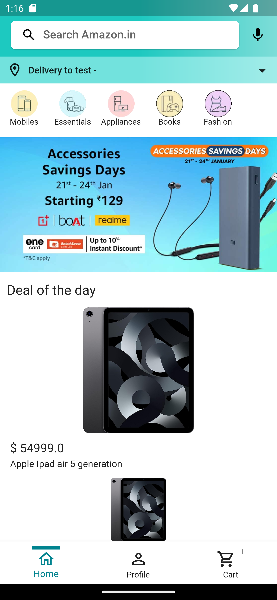
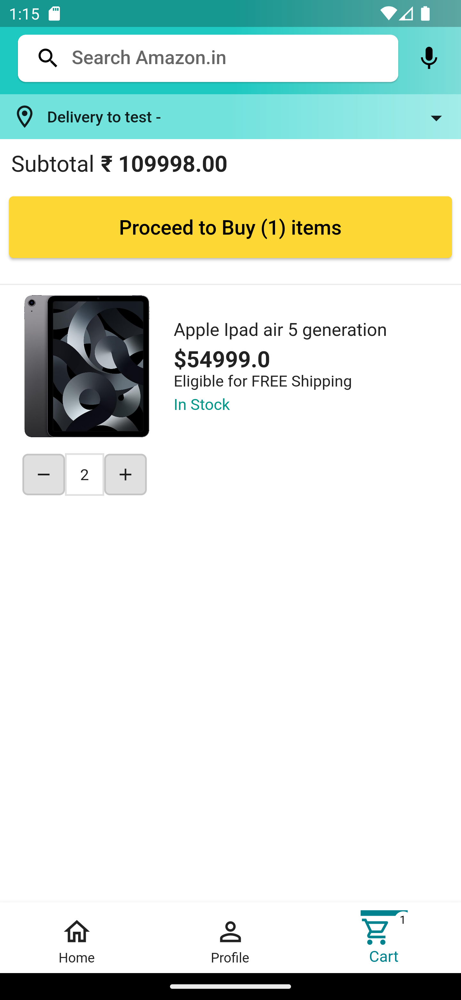
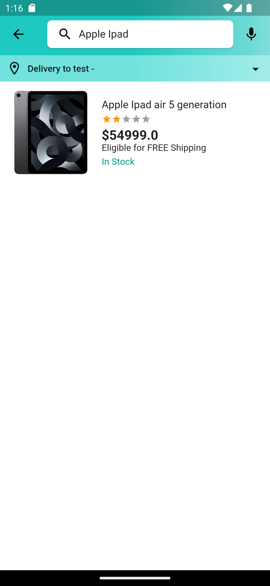

## Full Stack Amazon Clone

This project is a complete e-commerce application that replicates the functionality of Amazon, built using Flutter for the front-end and Node.js (with Express) and MongoDB with TypeScript for the back-end. The app offers a wide range of features, including user authentication, product management, order processing, and an admin panel for efficient control.

## Features
- Email & Password Authentication
- Persisting Auth State
- Searching Products
- Filtering Products (Based on Category)
- Product Details
- Rating
- Getting Deal of the Day
- Cart
- Checking out with Google/Apple Pay
- Viewing My Orders
- Viewing Order Details & Status
- Sign Out
- Admin Panel

## Screenshots
<p>
&nbsp&nbsp&nbsp&nbsp&nbsp&nbsp
</p>
## Running Locally

After cloning this repository, migrate to project folder. 
Then, follow the following steps:

### Server Side
```sh
  cd server
  npm install
  npm run dev (for continuous development)
  OR
  npm start (to run script 1 time)
```

### Client Side
```sh
# Make sure emulator is running
flutter pub get
flutter run
```

## Tech Used

Server: 
- **Language**: TypeScript
- **Tech Stack**: Node.js, Express, Mongoose, MongoDB, Cloudinary

Client: 
- **Language**: Dart
- **Tech Stack**: Flutter, Riverpod (State Management)